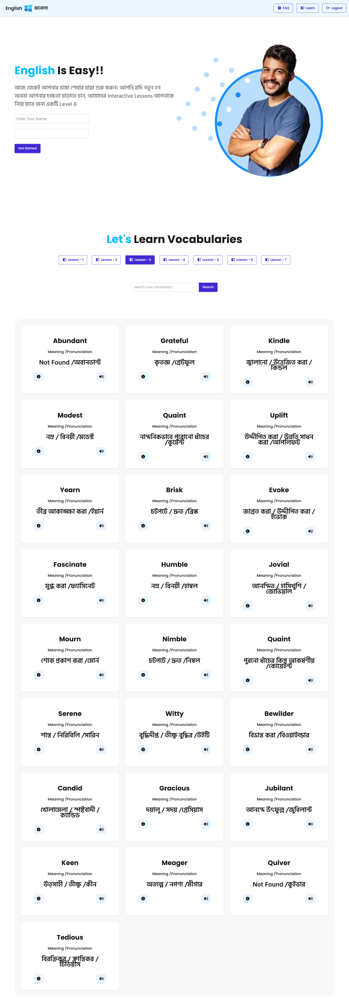

# English Janala Code

A simple educational web project for learning basic English concepts. This project uses HTML, CSS, and JavaScript to present interactive lessons and practice content in a clean layout.

## Screenshot



## Technologies Used

- HTML
- CSS
- JavaScript
- Tailwind CSS

## Features

- Responsive lesson layout for easy reading
- Interactive content handled by JavaScript
- Clean styling using Tailwind CSS and custom CSS
- Structured project files for HTML, CSS, and JavaScript

## Dependencies

- Tailwind CSS
- No other external libraries are required

## Run Locally

```bash
git clone https://github.com/ShafayatSadid/english-janala-code.git
cd english-janala-code
npm install
npm start
```

> If you do not use `npm start`, you can also open `index.html` directly in your browser.

## Links

- Live Demo: https://english-janala-toast.netlify.app/
- GitHub Repository: https://github.com/ShafayatSadid/english-janala-code
